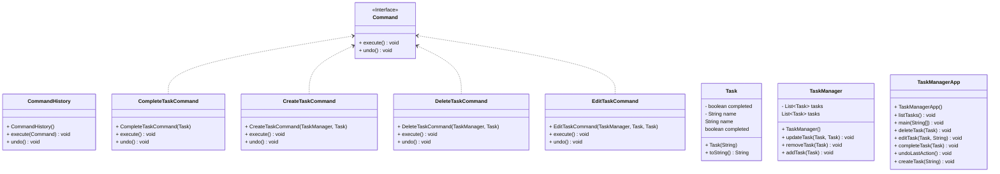

# Integrantes del equipo
- Juan David Marulanda
- Jefferson Morales Gonzalez
- Jhan Castro Vargas
- Laura Sofia Guio Camargo
- Natacha Castrillon
- Ruben Dario Suarez Amaya

## UML Diagrams:

### Ejercicio 4 Sistema de Gestión de Tareas

## Patters for each problem:
- Problem 1: Prototype
  - Prototype es un patrón de diseño creacional que nos permite copiar objetos existentes sin que el código dependa de sus clases.

- Problem 2: Observer
  - Observer es un patrón de diseño de comportamiento que te permite definir un mecanismo de suscripción para notificar a varios objetos sobre cualquier evento que le suceda al objeto que están observando, que en este caso es objeto de observacion es el mensaje.

- Problem 3: Template (ninguno le pego)
  - Template Method es un patrón de diseño de comportamiento que define el esqueleto de un algoritmo en la superclase pero permite que las subclases sobrescriban pasos del algoritmo sin cambiar su estructura.

- Problem 4: Command (ninguno le pego y tenemos dudas)
  - Command es un patrón de diseño de comportamiento que convierte una solicitud en un objeto independiente que contiene toda la información sobre la solicitud. Esta transformación te permite parametrizar los métodos con diferentes solicitudes, retrasar o poner en cola la ejecución de una solicitud y soportar operaciones que no se pueden realizar. 
  
- Problem 5: Decorator
  - Decorator es un patrón de diseño estructural que te permite añadir funcionalidades a objetos colocando estos objetos dentro de objetos encapsuladores especiales que contienen estas funcionalidades